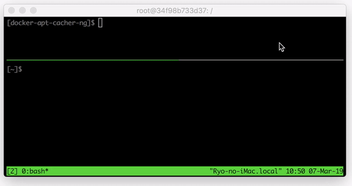

# docker-apt-cacher-ng
Docker image for caching apt powered by `apt-cacher-ng`.



## Run

Run the cache server as follows.

```bash
docker run -it -p 3142:3142 -v $PWD/docker-volumes/apt-cacher-ng:/var/cache/apt-cacher-ng cache
```

All caches are persisted under `$PWD/docker-volumes/`. So, you can easily to down the server and restart.


## Cache Usage

Suppose you would like to use `ubuntu:16.04`. You can run as follows, specifying `http_proxy=<DOCKER_HOST_IP>:3142`.

```bash
docker run -it -e http_proxy=http://192.168.11.3:3142  ubuntu:16.04
```
(NOTE: `192.168.11.3` is my docker host. Replace it with yours)
